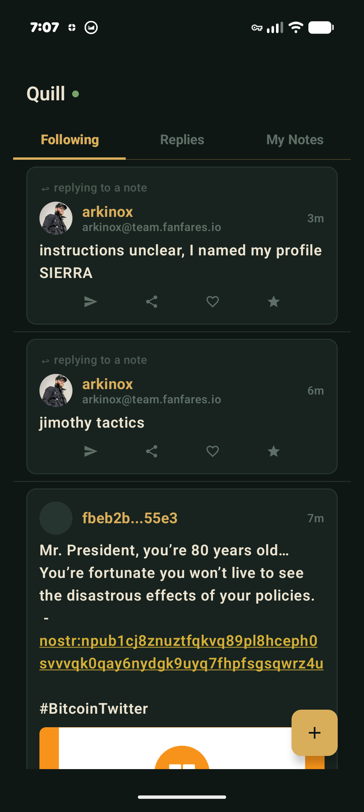
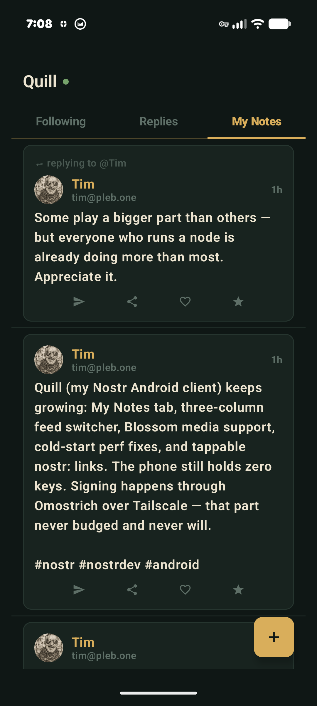
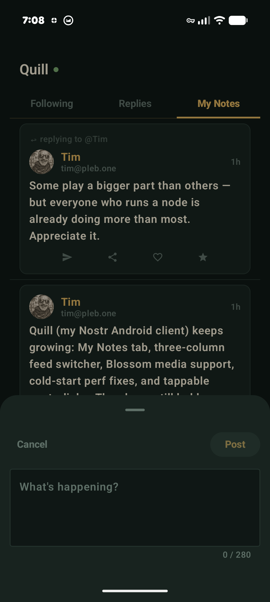

# Quill

A Nostr client for Android that never holds your keys. It reads from relays
directly and signs everything through Omostrich, your desktop signer daemon,
over Tailscale. The nsec stays on your laptop. The phone is just a window.

## How it works

```
Phone (Quill)                     Laptop (Omostrich)
  │                                  │
  ├── reads ──→ Nostr relays         │
  │                                  │
  ├── builds unsigned event          │
  │── sends over Tailscale ──────→  signs with nsec
  │←── returns signed event ─────   │
  │                                  │
  └── publishes to relays ──────────
```

The nsec never leaves Omostrich. The phone builds the event, sends it through
an encrypted WireGuard tunnel to your laptop, and Omostrich stamps it with the
key it already holds. The signed event comes back and the phone publishes it.

## Architecture

- **nostrdb** — Embedded Nostr database (C + LMDB, cross-compiled via Rust + NDK)
  - Events ingested from relays, persisted to disk
  - Queried via JNI bridge for feed, thread, and author-filtered queries
- **RelayClient** — OkHttp WebSocket, multi-relay subscriptions with auto-reconnect
- **OmostrichClient** — Raw TCP to the Omostrich daemon, line-delimited JSON protocol
- **Compose UI** — Jetpack Compose, Omarchy design language (dark palette, gold accent)
- **Coil** — Image loading with disk cache

## Screenshots

<p align="center">
  
  
  
</p>

## What it does

- Three-tab feed: Following, Replies, My Notes
- Thread view with reply context ("↩ replying to @Name")
- Profile resolution with avatars (Coil cache)
- Compose and post via Omostrich remote signing
- Blossom media support (images inline, video thumbnails)
- Link previews via Open Graph
- Tappable nostr: links (opens in njump.me)
- Cold start caching (nostrdb disk + profiles.json + Coil)

## Build

Requires:
- Android SDK 36, NDK 28.2+
- JDK 21 (Temurin)
- Kotlin 2.4+, Rust with `aarch64-linux-android` and `x86_64-linux-android` targets

```bash
./gradlew assembleDebug
# APK at app/build/outputs/apk/debug/app-debug.apk
```

The Gradle build compiles the Rust JNI bridge for both ARM64 and x86_64
automatically — no separate `cargo build` step needed.

## Dependencies

- [Omostrich](https://github.com/ninepointlabs/omostrich) — Nostr signer daemon on your laptop
- [Tailscale](https://tailscale.com) — encrypted tunnel between phone and laptop
- [nostrdb](https://github.com/damus-io/nostrdb) — embedded Nostr database (built from source via NDK)

## License

MIT — [ninepointlabs](https://github.com/ninepointlabs)